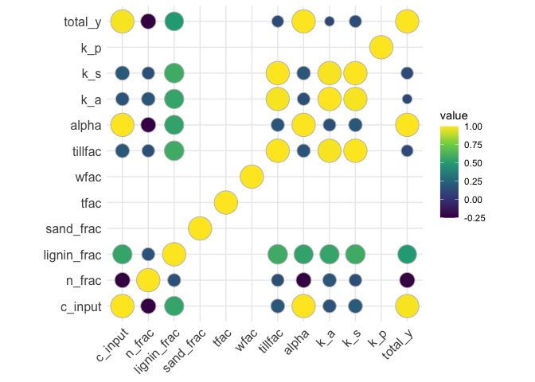

*Legumes Translated* soil carbon modelling – project handbook
================
Dr Alasdair Sykes
05/01/2021

## Overview

This repository contains inputs, code and outputs for soil carbon
modelling work performed to accompany the Legumes Translated project.
The model input data compares a set of control rotations to a series of
alternative legume-based rotations; model outputs detail expected soil
carbon stock change as a result of these different management
strategies. All code in the root directory is reproducible with the
contents of this repository; external data read-in is handled in the
`raw-data` directory.

## Model and data provenance

Soil carbon modelling is performed using an R package-based
implementation of the IPCC (2019) Tier 2 steady-state soil carbon model
for national level greenhouse gas reporting. Full details of the model
methodology can be found
[here](https://www.ipcc-nggip.iges.or.jp/public/2019rf/vol4.html);
documentation of the corresponding R package implementation can be found
[here](https://github.com/aj-sykes92/soilc.ipcc).

Spatial data used in the modelling process is (1) climate data from the
CRU project, available open-source here
[here](https://crudata.uea.ac.uk/cru/data/hrg/cru_ts_4.03/), and (2)
soil data from the SoilGrids project, available open-source
[here](https://soilgrids.org). Spatial definition of the study sites is
based on NUTS 2017 Level 2 data, with corresponding shapefiles available
[here](https://ec.europa.eu/eurostat/web/gisco/geodata/reference-data/administrative-units-statistical-units/nuts).

## Schema in brief

### Code

  - `01-spatial-data-processing.R` Processing of the study spatial data,
    resulting in study site-specific outputs of climate and soil data.

  - `02-model-data-assembly.R` Reading of the raw supplied data files
    and construction of the raw model data.

  - `03-model-input-processing.R` Conversion of the assembled raw data
    input model inputs and creation of the soil carbon model runs using
    the `soilc.ipcc` package.

  - `04-model-output-processing.R` Summarisation of the model outputs
    into summary datasets and plots.

### Subdirectories

  - **model-data** Data directory containing model input and output
    datasets.

  - **model-output-summaries** Data directory containing summarised
    model outputs.

  - **raw-data** Data directory containing raw spatial data, raw study
    data as supplied, and data translation scripts.

  - **spatial-data** Data directory containing processed spatial data.

## Methods in brief

For each study site, the spatial data was cropped and masked against the
relevant NUTS level 2 shapefile, and arithmetic mean was calculated for
mean monthly temperature, precipitation, potential evapotranspiration,
and soil sand fraction. The spatial climate data represented 20-year
monthly mean conditions. These conditions were repeated for the duration
of the model runs.

Data referencing crop management and manure application practices was
taken as supplied and matched up to analogous crop and manure categories
in the relevant IPCC (2019) methodology. The `soilc.ipcc` package was
used to build model inputs accordingly, and to compute the model runs.

For each study site and control-treatment pair (control = no legumes in
the rotation, treatment = legumes in the rotation) the model was run
three times; once for equilibrium control conditions, once for
equilibrium treatment conditions, and once for a transition from control
to treatment conditions. For each model run, the model was run in for a
period of 50 years with averaged conditions (climate, soil and organic
inputs) followed by a period of 500 years in the relevant rotation. For
the transition from control to treatment, the model was run in in mean
control conditions, calculated for year 1–50 in the control rotation,
and transitioned to treatment conditions for years 51–500.

Model results were summarised to calculate a mean soil carbon stock for
the final 50 years of equilibrium conditions in control and treatment
rotations, and to find a 20- and 50-year mean carbon stock change post
transition in the transitional run.

## Results and analysis

Results from the model transitional runs are presented in Fig 1.

**Fig. 1.** C stock results from the model transitional runs

The summary statistics for the model runs are as follows:

| Control   | Treatment  | Control stocks (tonnes C ha-1) | Treatment stocks (tonnes C ha-1) | Annual stock change, 20-year (tonnes C ha-1) | Annual stock change, 50-year (tonnes C ha-1) |
| :-------- | :--------- | ----------------------------------------: | ------------------------------------------: | ------------------------------------------------------: | ------------------------------------------------------: |
| 01\_-leg  | 01\_+leg   |                                     29.30 |                                       24.30 |                                                  \-0.04 |                                                  \-0.03 |
| 02\_-leg  | 02\_+leg   |                                     28.76 |                                       26.59 |                                                  \-0.02 |                                                  \-0.01 |
| 03\_-leg  | 03\_+leg1  |                                     28.38 |                                       24.52 |                                                  \-0.02 |                                                  \-0.03 |
| 03\_-leg  | 03\_+leg2  |                                     28.38 |                                       23.07 |                                                  \-0.05 |                                                  \-0.03 |
| 04\_-leg  | 04\_+leg   |                                     36.64 |                                       29.67 |                                                  \-0.05 |                                                  \-0.04 |
| 05\_-leg  | 05\_+leg   |                                     35.62 |                                       41.73 |                                                    0.06 |                                                    0.04 |
| 06\_-leg  | 06\_+leg   |                                     26.18 |                                       33.50 |                                                    0.06 |                                                    0.04 |
| 07\_-leg  | 07\_+leg   |                                     39.63 |                                       35.24 |                                                  \-0.02 |                                                  \-0.01 |
| 08\_-leg  | 08\_+leg   |                                     45.69 |                                       35.74 |                                                  \-0.10 |                                                  \-0.06 |
| 09\_-leg  | 09\_+leg   |                                     28.96 |                                       30.26 |                                                    0.01 |                                                    0.01 |
| 10\_-leg  | 10\_+leg   |                                     41.80 |                                       36.53 |                                                  \-0.06 |                                                  \-0.04 |
| 11\_-leg  | 11\_+leg   |                                     49.80 |                                       43.49 |                                                  \-0.07 |                                                  \-0.04 |
| 12\_-leg  | 12\_+leg   |                                     59.73 |                                       48.24 |                                                  \-0.06 |                                                  \-0.06 |
| 13\_-leg  | 13\_+leg   |                                     61.19 |                                       45.52 |                                                  \-0.10 |                                                  \-0.10 |
| 14\_-leg  | 14\_+leg   |                                     44.17 |                                       39.50 |                                                  \-0.02 |                                                  \-0.02 |
| 15a\_-leg | 15a\_+leg1 |                                     24.32 |                                       23.85 |                                                  \-0.01 |                                                  \-0.01 |
| 15a\_-leg | 15a\_+leg2 |                                     24.32 |                                       24.93 |                                                    0.00 |                                                    0.00 |
| 15b\_-leg | 15b\_+leg1 |                                     20.55 |                                       18.18 |                                                  \-0.02 |                                                  \-0.01 |
| 15b\_-leg | 15b\_+leg2 |                                     20.55 |                                       17.90 |                                                  \-0.03 |                                                  \-0.01 |
| 16\_-leg  | 16\_+leg   |                                     49.88 |                                       27.18 |                                                  \-0.13 |                                                  \-0.10 |
| 17\_-leg  | 17\_+leg1  |                                     32.02 |                                       27.26 |                                                  \-0.03 |                                                  \-0.02 |
| 17\_-leg  | 17\_+leg2  |                                     32.02 |                                       30.62 |                                                    0.00 |                                                    0.00 |
| 18\_-leg  | 18\_+leg1  |                                     84.57 |                                       91.74 |                                                    0.05 |                                                    0.00 |
| 18\_-leg  | 18\_+leg2  |                                     84.57 |                                       73.50 |                                                  \-0.17 |                                                  \-0.09 |
| 18\_-leg  | 18\_+leg3  |                                     84.57 |                                       73.50 |                                                  \-0.17 |                                                  \-0.09 |
| 18\_-leg  | 18\_+leg4  |                                     84.57 |                                       73.42 |                                                  \-0.18 |                                                  \-0.09 |
| 18\_-leg  | 18\_+leg5  |                                     84.57 |                                       33.24 |                                                  \-0.44 |                                                  \-0.28 |
| 18\_-leg  | 18\_+leg6  |                                     84.57 |                                       82.37 |                                                  \-0.13 |                                                  \-0.05 |
| 19\_-leg  | 19\_+leg1  |                                     41.36 |                                       44.04 |                                                    0.04 |                                                    0.02 |
| 19\_-leg  | 19\_+leg2  |                                     41.36 |                                       28.77 |                                                  \-0.08 |                                                  \-0.06 |
| 20\_-leg  | 20\_+leg   |                                     46.68 |                                       32.18 |                                                  \-0.14 |                                                  \-0.10 |

Some analysis has been performed in order to determine the driving
factors behind C stock response to the change in rotations. Initially,
correlation between the key model input and output variables for
treatment (legume) rotations was computed (Fig. 2).

**Fig. 2.** Correlation plot for treatment rotation variables. Variabile
`total_y` indicates the size of the total soil C pool in tonnes per
hectare.

While this plot shows the driving factors behind equilbrium soil C for
the treatment variables, these treatments are also following some
potentially quite different control rotations. To further interrogate
the data, a similar correlation-based approach was taken, with the focus
on the net difference (`treatment - control`) between the model input
and output variables. Note that some environmental variables are
identical for control and treatment, and that therefore differential
correlation was not possible to compute.

**Fig. 3.** Correlation plot for difference in treatment vs. control
rotation variables.

Interpretation of Fig. 3 suggests that differences in equilibrium carbon
stocks are largely driven by differences in total carbon inputs
`c_input`, differences in nitrogen and lignin fractions `n_frac` and
`lig_frac`, and to a lesser extent differences in tillage practices
`till_fac`. Resulting calculated model variables `alpha`, `k_a` and
`k_s` carry this through to the final `total_y` (tonnes C
ha-1) estimate.

Fig. 4 shows the major differences in model variables where results
following transition to treatment rotations were positive vs. negative
for resulting soil carbon stock changes.

**Fig. 4.** Boxplot showing differences between model variables for
positive and negative soil carbon responses.

Interpretation of Fig. 4 confirms the indication of the correlation
plots, but suggests the loss of soil C, where present, is primarily due
to differences in organic matter inputs to the soil from the different
rotations.

## Contact

All queries relating to this work should be addressed to the author at
<alasdair.sykes@sruc.ac.uk>.
